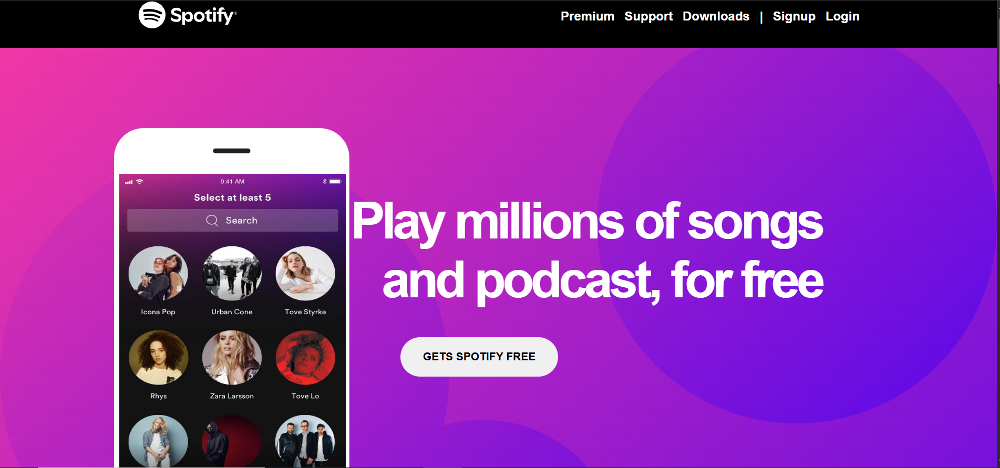

# Spotify Clone 🎵

A static web project that replicates the look and feel of Spotify's landing page.  
Built with HTML, CSS, and JavaScript.

## 🌐 Live Demo
[Click here to view the project](https://kshitij-pal99.github.io/Staticwebsites/)

## 📸 Screenshots

## 🛠️ Technologies Used
- HTML5
- CSS3
- JavaScript

## 🚀 Features
- Responsive design
- Clean and modern UI
- Optimized for all screen sizes

## 📬 Contact
If you'd like to connect or discuss the project:
- Email:kshitijpal@18gmail.com
- LinkedIn:https://www.linkedin.com/in/kshitij-pal-9475aa265
